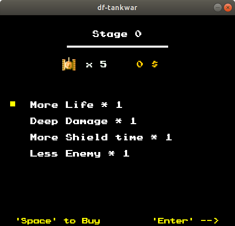
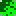

# df's mini Tank War


Welcome to my mini Tank World ! The interest in Tank 1990 and the desire to improve my C++ programming skill drive me to compelete this Project. It is very interested to play a game designed by yourself, even it is 30 years old !

## Preparation

 - make
 - libsdl2-dev
 - libsdl2-ttf-dev
 - libsdl2-image-dev

To get all dependent libs, use:

`sudo apt install libsdl2-dev libsdl2-ttf-dev libsdl2-image-dev` on Debian/Ubuntu.

## Build

```shell
cd tankwar
make
```

After `make` completes, a binary file called `main` will appear.

type `./main` to start the game !

## about Game

The Game Resources are all from Internet. During the development, I refer to [krystiankaluzny/Tanks](https://github.com/krystiankaluzny/Tanks). Thank him to open his resources and code completely, which help me a lot. Game was written in C++11 and SDL2 2D graphic library.





### Controls:

 - Player 1: arrows and right CTRL to fire
 - Player 2: WSAD and left CTRL to fire
 - Pause: ENTER (To do)

### Enemies
Enemy tanks may fire at most four shells at the same time.

If shells hit target, brick or stage border and explodes then enemy can reload and fire again.

Enemies have one of four different armour levels. Each level has a different color.

After a enemy shell hits you, your HP will decrease.
If the enemy HP falls to zero, then enemy will be destroyed, so will you.

If you kill a enemy successfully, you will get paied.

### Enemy types

According to Tank 1990 and [krystiankaluzny/Tanks](https://github.com/krystiankaluzny/Tanks), enemy tanks' behaviour is really complicated. But I gonna to design a new AI for enemy tanks. 

 -  A:
    - target: closest player or eagle; 
    - speed: normal: 
    - behaviour: 80% to move towards the target, 20% to move in random direction,
    - constantly fires in movement direction
 -  B: 
    - target: eagle; 
    - speed: 1.3 * normal; 
    - behaviour: 50% to move towards the target, 50% to move in random direction, 
    - constantly fires in movement direction
 -  C: 
    - target: eagle; 
    - speed: normal;
    - behaviour: 50% to move towards the target, 50% to move in random direction, 
    - constantly fires in movement direction
 -  D:
    - target: closest player or eagle;
    - speed: normal;
    - behaviour: 50% to move towards the target, 50% to move in random direction,
    - fires if target is in front of

### Bonus & Store

In coming ...

 -  Grenade: all enemies are destroyed
 -  Helmet: active player shield for 10 seconds
 -  Clock: freeze all enemies for 8 seconds
 -  Shovel: create stone wall around eagle for 15 seconds
 -  Tank: increase player lives count 
 -  Star: increase player speed, each next one increase max shells count
 -  Gun: increase shells damage
 -  Boat: allows to move on the water

### maps

According to Tank 1990, the number of levels is 35. For convenience, maps are plain text files, which are located in `resources/level` directory.
Each level is a two dimensional array with 26 rows and 26 columns.
Each field in the array should be one of following elements:

 - **.** Empty field
 - **#**  Brick wall: it can be destroyed with two bullets or one if you collect three Stars or Gun
 - **@**  Stone wall: it can be destroyed only if you collect three Stars or Gun bonus
 - **%**  Bush: it can be erased only if you collect three Stars or Gun bonus
 - **~**  Water: it is natural obstacle unless you collect Boat bonus
 - **-**  Ice: tanks are slipping on it (To do)

